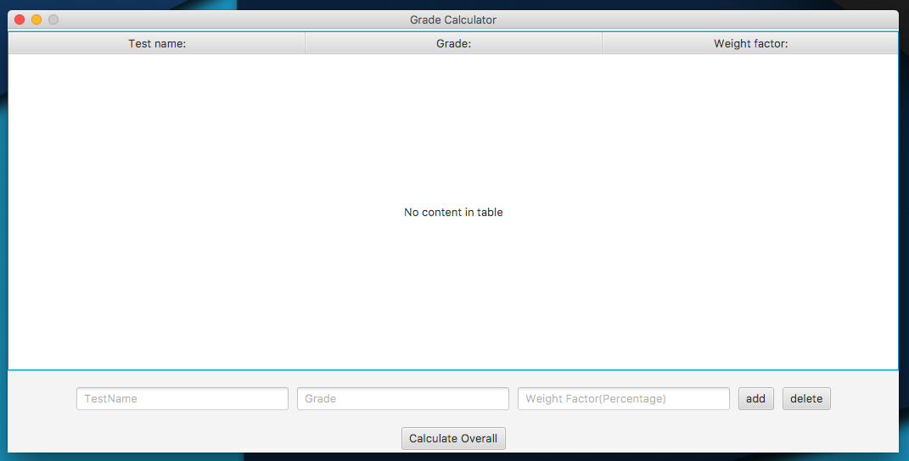
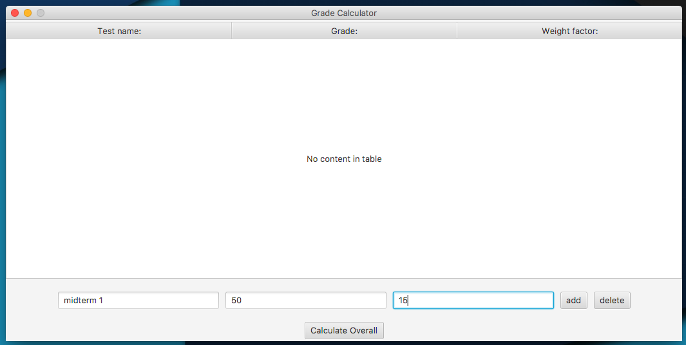
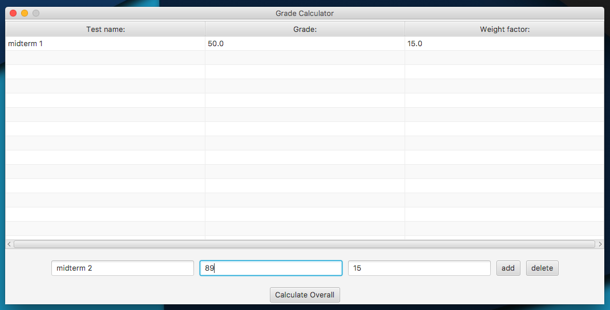
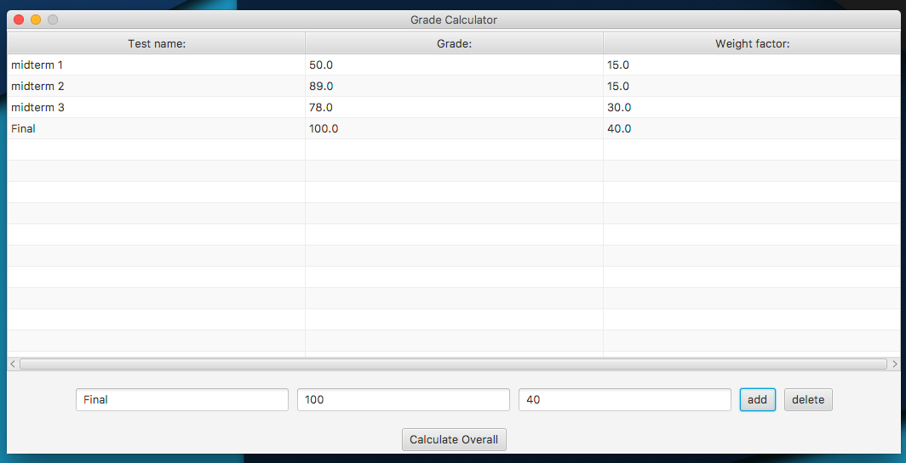
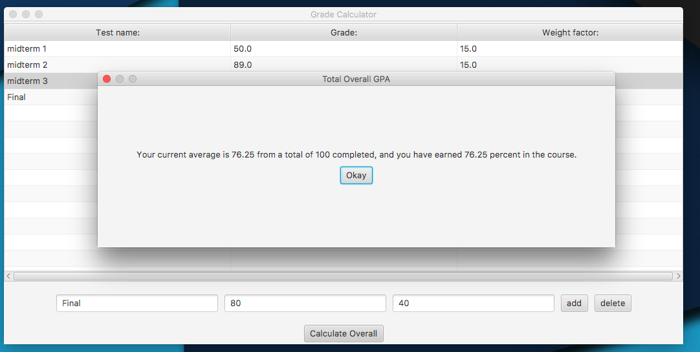
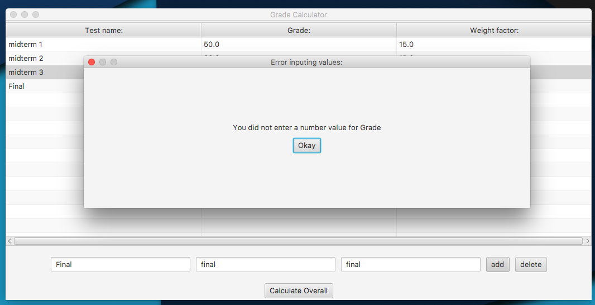
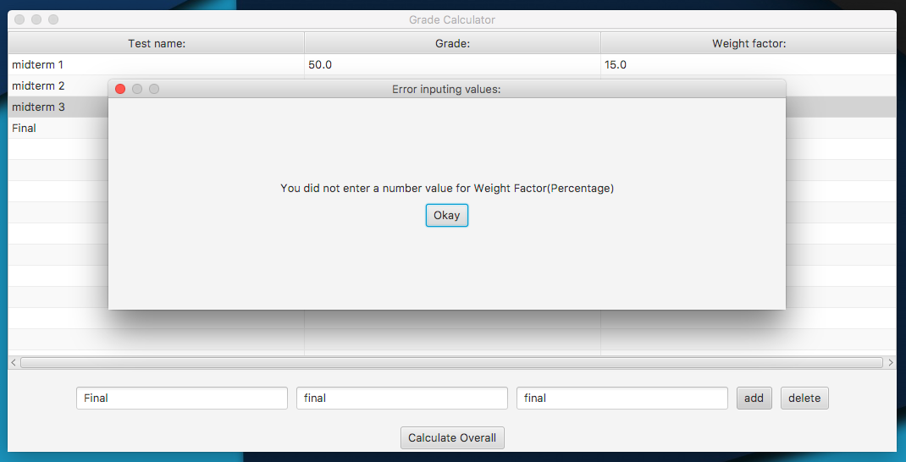
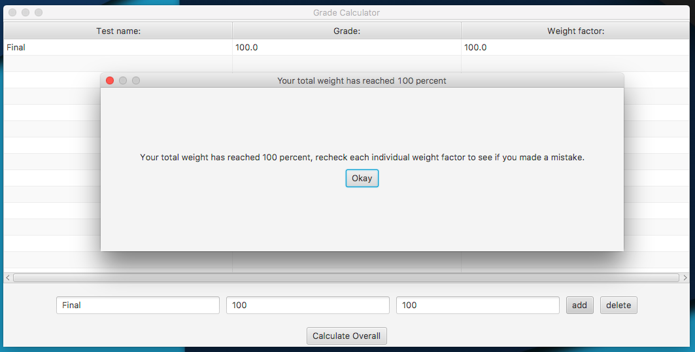
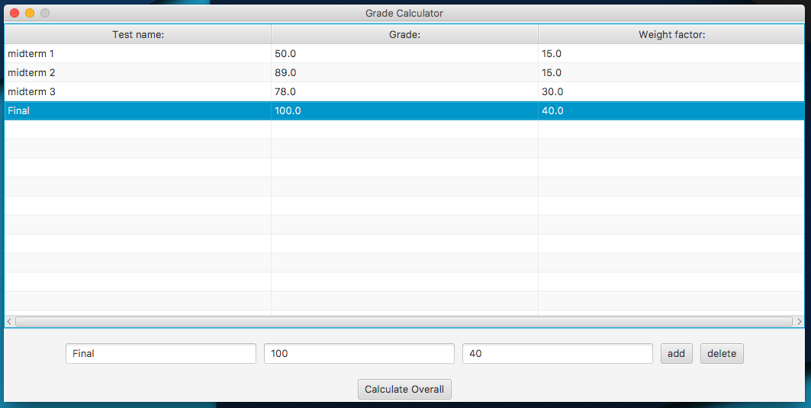

# Grade Calculator
### This JAVAFX application was made so student can easy calculate thier overall average using the application.

### In the main screen the student is given an option to add a new test mark to the table.

### Once the student fills out each individual textfeild the student can click the add button for the mark to appear on the table.

### The student can add marks until the user has reaced a max total weight of 100.

### Once the student has inputted their upto date marks the student can click the calculate overall button to see their overall.

### Now the student is informed with their current overall in an alertbox, and the student can end the application or go back to make a few changes.

### This application does a very good job when it comes to user input validation, and make it user friendly.

### The application prompts an error message when the user tries to add more marks when the total wieght has already reached 100 percent in the table.

### The student can easily remove a mark if they choose to by easly clicking on the mark in the table then clicking the delete button.

